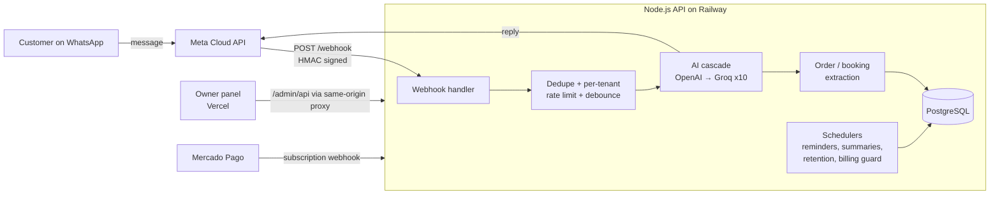
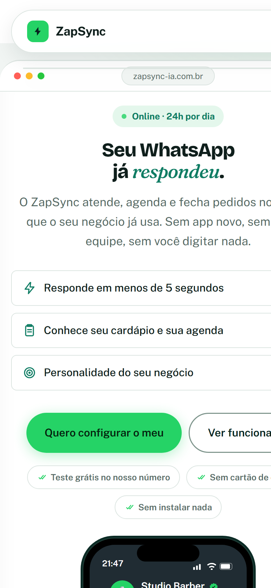
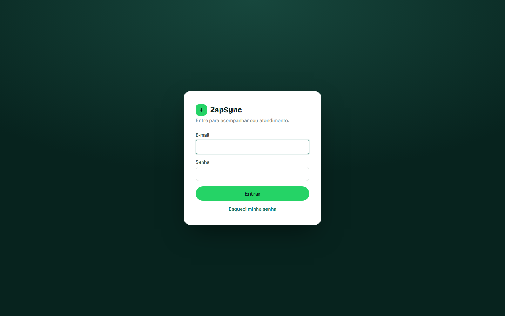

# ZapSync · AI customer service on WhatsApp

> 🇧🇷 [Leia em português](README.pt-BR.md)

**ZapSync is a multi-tenant SaaS I designed, built and run on my own.** Small businesses in Brazil (restaurants, pizzerias, barbershops, clinics) connect their WhatsApp number and an AI assistant answers customers 24/7, takes orders, books appointments and hands the conversation to a human when needed. Owners manage everything in a web panel, and the whole lifecycle (sign-up, WhatsApp connection, billing, suspension) is self-service.

**Live:** [zapsync-ia.com.br](https://www.zapsync-ia.com.br) · **Source code:** private (it is a commercial product). This repository is a public showcase: architecture, engineering decisions and a few representative code excerpts with tests. I am happy to walk through the private code in an interview.

## At a glance

| | |
|---|---|
| **Role** | Solo: product, backend, frontend, infrastructure, billing integration, customer onboarding and support |
| **Backend** | Node.js + Express, PostgreSQL, ~8,200 lines across 23 modules |
| **Frontend** | Vanilla HTML/CSS/JS, no build step, ~5,400 lines (marketing site, owner panel, operator panel) |
| **Tests** | 137 automated tests running against a real PostgreSQL database |
| **Integrations** | Meta WhatsApp Cloud API (official), OpenAI, Groq, Mercado Pago subscriptions, Google Maps, ViaCEP, SMTP |
| **Hosting** | Railway (API + Postgres), Vercel (site and panel) |

## What it does

- **Natural conversation on WhatsApp**, no numbered menus. The AI knows the business's menu or services, opening hours and tone of voice.
- **Order and appointment detection.** The AI extracts structured orders (items, sizes, pizza flavors, options, quantities) and bookings. Double booking is prevented at the database level with a unique index, not only in application code.
- **Automations:** appointment reminders, stuck-order alerts, post-delivery follow-up with a rating, daily summary to the owner.
- **Human handoff:** the owner can pause the bot for one conversation and take over.
- **Owner panel:** dashboard, orders, products (with spreadsheet import), appointments, CRM, reports, settings and an AI diagnostics page.
- **Self-service onboarding:** invitation-gated sign-up and WhatsApp connection through Meta's **Embedded Signup**, so no one on my side has to touch the customer's Business Manager.
- **Recurring billing** with Mercado Pago subscriptions: payment confirmation creates the sign-up invite automatically; failed payments trigger a grace period and then automatic suspension (no data is deleted); paying again reactivates instantly.
- **Operator panel** to see every tenant, subscription status and connection state, plus an audit log of sensitive actions.
- **LGPD (Brazilian GDPR):** conversation history is purged automatically after a configurable retention period.

## Architecture

More diagrams (message lifecycle, billing lifecycle, tenant isolation) in [docs/architecture.md](docs/architecture.md).

## Engineering highlights

| Problem | What I did | Code |
|---|---|---|
| One slow provider could hang requests and drain the connection pool | Every outbound call has a hard timeout (native `AbortSignal.timeout`) | [fetch-timeout.js](snippets/fetch-timeout.js) |
| Anyone who found the webhook URL could forge customer messages | HMAC-SHA256 validation over the raw body with constant-time comparison | [verify-meta-signature.js](snippets/verify-meta-signature.js) |
| Meta re-delivers webhooks, so the bot sometimes answered twice | Message-id deduplication with TTL and sweeping | [dedupe.js](snippets/dedupe.js) |
| AI providers go down or hit rate limits; a customer must never be left without a reply | Ordered 11-step cascade across providers, accounts and model sizes, with per-provider stats in the panel | [ai-cascade.js](snippets/ai-cascade.js) |
| A logged-in owner must never see another business's data | `business_id` only from the signed session, every query scoped, same 404 for "missing" and "not yours", cross-tenant tests | [tenant-scope.js](snippets/tenant-scope.js) |
| Third-party cookies are blocked more and more by browsers | Panel calls the API through a Vercel same-origin proxy, so the session cookie is first-party (`SameSite=Lax`) | [docs/decisions.md](docs/decisions.md) |

All excerpts are simplified from production code and covered by tests in [snippets/test](snippets/test) (`npm test`).

## Security

- Passwords hashed with `scrypt` and per-user salt; login brute-force lock (8 attempts per IP + e-mail in 15 min) with identical error messages.
- HMAC-signed session cookie (`HttpOnly`, `Secure`, `SameSite=Lax`, 12 h), re-validated against the database on every request, so changing the password or disabling a user ends sessions immediately.
- Invite and password-reset tokens stored only as hashes, single use, short expiry.
- Both webhooks (Meta and Mercado Pago) validate signatures.
- Security headers (HSTS, CSP, frame and referrer policies), `Cache-Control: no-store` on the admin API, per-route rate limits.
- Phone numbers masked in logs; sensitive request bodies never logged.

## Testing and operations

- `node --test` suite with 137 cases running serially against a real PostgreSQL: tenant isolation, sign-up races, password recovery, catalog and pizza flavors, time zones in scheduling, AI order extraction, and regression cases taken from real production logs.
- Additive, idempotent migrations run on boot, so a deploy never needs manual database steps.
- CLI scripts for operations: create invites, grant operator access, create billing plans, bulk-import menus from other POS systems.

## What I learned

- **Reliability comes from boring details:** timeouts, idempotency, retries with fallbacks and deduplication prevented more incidents than any feature.
- **Support experience shapes the product.** Years of N2/N3 support in food-service software (fiscal documents, card payments, integrations) taught me which failures hurt a restaurant at 8 p.m. on a Friday, and the product is built around avoiding them.
- **Self-service matters for a solo founder.** Embedded Signup and automated billing turned onboarding from a manual call into a flow the customer completes alone.

## Screenshots

| Mobile | Owner panel login |
|---|---|
|  |  |

Full landing page: [docs/img/site-full.png](docs/img/site-full.png)

## About me

I'm **Abner Duarte**, from Brazil: technical support analyst (N2/N3 and implementation) moving into cloud support and software engineering. I speak English fluently and I'm studying for AWS certifications.
GitHub: [@darkslipx](https://github.com/darkslipx)

---

The ZapSync product and its source code are proprietary. The code excerpts in [`snippets/`](snippets) are released under the MIT license.
