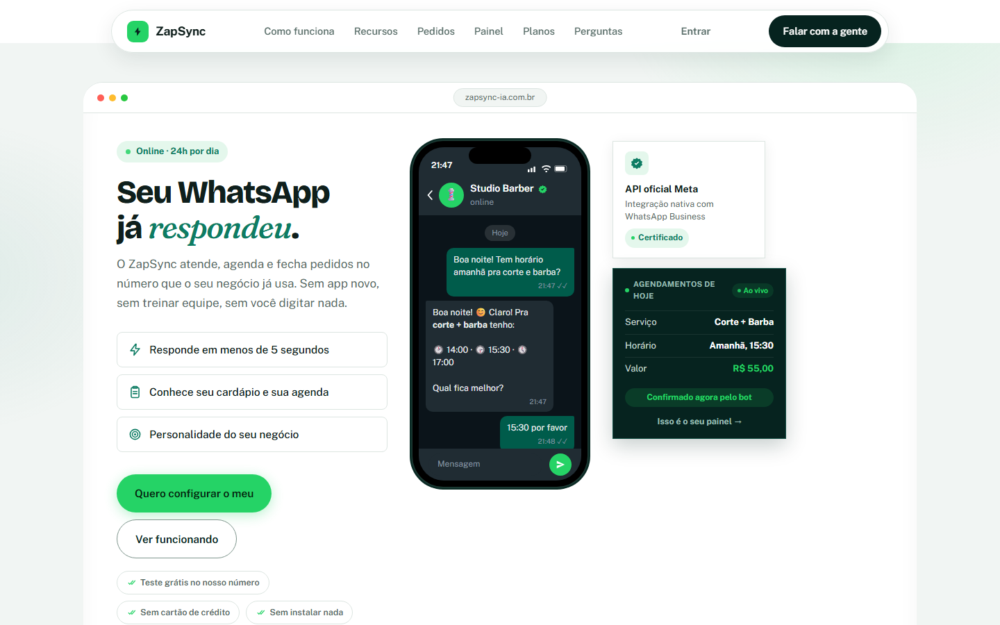

# ZapSync · Atendimento com IA no WhatsApp

> 🇺🇸 [Read in English](README.md)

**O ZapSync é um SaaS multi-tenant que eu projetei, desenvolvi e opero sozinho.** Pequenos negócios (restaurantes, pizzarias, barbearias, clínicas) conectam o número de WhatsApp e uma IA atende os clientes 24 horas, fecha pedidos, marca horários e passa a conversa para um humano quando precisa. O dono gerencia tudo num painel web, e o ciclo inteiro (cadastro, conexão do WhatsApp, cobrança, suspensão) é self-service.

**No ar:** [zapsync-ia.com.br](https://www.zapsync-ia.com.br) · **Código-fonte:** privado (é um produto comercial). Este repositório é uma vitrine pública: arquitetura, decisões de engenharia e alguns trechos de código representativos, com testes. Posso mostrar o código privado numa entrevista.

## Resumo

| | |
|---|---|
| **Papel** | Tudo: produto, backend, frontend, infraestrutura, integração de pagamento, onboarding e suporte aos clientes |
| **Backend** | Node.js + Express, PostgreSQL, cerca de 8.200 linhas em 23 módulos |
| **Frontend** | HTML/CSS/JS puro, sem build, cerca de 5.400 linhas (site, painel do dono, painel do operador) |
| **Testes** | 137 testes automatizados rodando contra um PostgreSQL real |
| **Integrações** | API oficial do WhatsApp (Meta Cloud API), OpenAI, Groq, assinaturas Mercado Pago, Google Maps, ViaCEP, SMTP |
| **Hospedagem** | Railway (API + Postgres) e Vercel (site e painel) |

## O que faz

- **Conversa natural no WhatsApp**, sem menu numerado. A IA conhece o cardápio ou os serviços, o horário e o jeito de falar do negócio.
- **Detecção de pedido e agendamento**, com itens, tamanhos, sabores de pizza, opções e quantidades. Conflito de horário é barrado no banco (índice único), não só no código.
- **Automações:** lembrete de agendamento, alerta de pedido travado, follow-up pós-entrega com avaliação, resumo diário para o dono.
- **Atendimento humano:** o dono pausa o bot numa conversa e assume.
- **Painel do dono:** dashboard, pedidos, produtos (com importação de planilha), agenda, CRM, relatórios, configurações e diagnóstico da IA.
- **Onboarding self-service:** cadastro por convite e conexão do WhatsApp pelo **Embedded Signup** da Meta.
- **Cobrança recorrente** com Mercado Pago: pagamento confirmado gera o convite; falha de pagamento abre período de tolerância e depois suspende sem apagar dados; pagou, reativa na hora.
- **Painel do operador** com todos os negócios e **log de auditoria** das ações sensíveis.
- **LGPD:** histórico de conversa expurgado automaticamente após o prazo de retenção.

## Arquitetura e decisões

- Diagramas: [docs/architecture.md](docs/architecture.md)
- Decisões de engenharia e por quê: [docs/decisions.md](docs/decisions.md)
- Trechos de código com testes: [snippets/](snippets) (`npm test`)

## Destaques de engenharia

- **Timeout em toda chamada externa**, para um provedor lento não travar o serviço.
- **Validação HMAC do webhook da Meta** sobre o corpo cru, com comparação em tempo constante.
- **Deduplicação** dos reenvios do webhook, que faziam o bot responder duas vezes.
- **Cascata de IA com 11 tentativas** (OpenAI e várias contas Groq, modelo grande e pequeno), para o cliente nunca ficar sem resposta.
- **Isolamento entre negócios:** o `business_id` vem só da sessão assinada, e existem testes tentando atravessar de um negócio para outro.
- **Proxy same-origin na Vercel**, para o cookie do painel ser first-party e não sofrer com o bloqueio de cookies de terceiros.

## O que aprendi

- Confiabilidade vem de detalhes chatos: timeout, idempotência, fallback e deduplicação evitaram mais incidentes do que qualquer funcionalidade.
- A experiência de suporte N2/N3 em sistemas de food service (fiscal, TEF, integrações) guiou o produto: eu sabia o que dói num restaurante numa sexta às 20h.
- Para quem opera sozinho, self-service é essencial: Embedded Signup e cobrança automática tiraram o onboarding do manual.

## Sobre mim

Sou **Abner Duarte**, analista de suporte técnico (N2/N3 e implantação) em transição para cloud support e desenvolvimento. Inglês fluente, estudando para as certificações AWS.
GitHub: [@darkslipx](https://github.com/darkslipx)

---

O produto ZapSync e seu código-fonte são proprietários. Os trechos em [`snippets/`](snippets) estão sob licença MIT.
