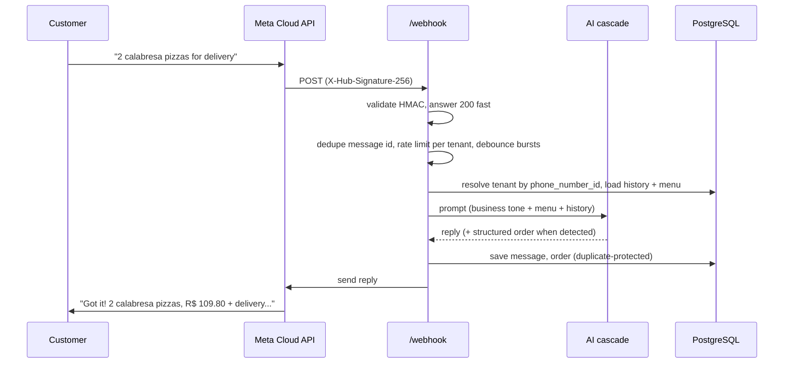
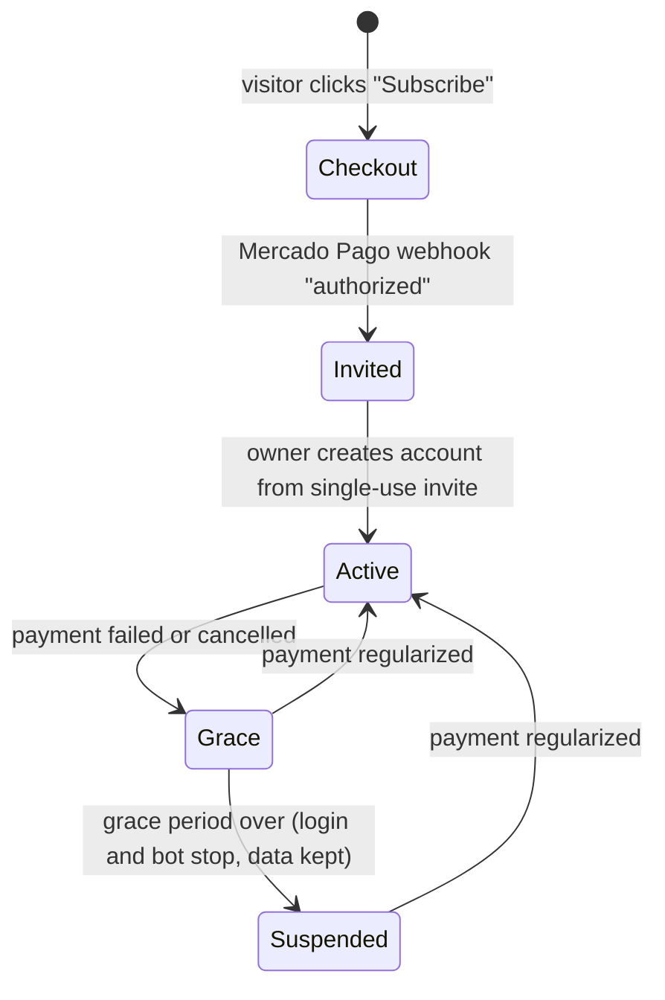
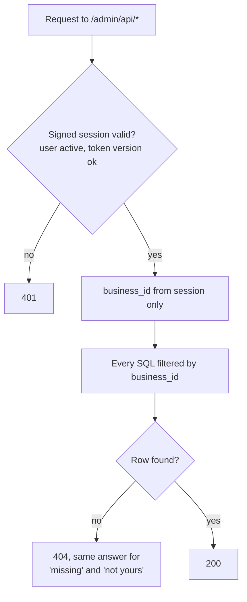

# Architecture

## Components

| Component | Where | Responsibility |
|---|---|---|
| Marketing site + owner panel + operator panel | Vercel (static, no build step) | Sign-up, WhatsApp connection, day-to-day management |
| API | Railway, Node.js + Express | Webhook processing, AI, admin API, billing, schedulers |
| Database | Railway PostgreSQL | Tenants, users, messages, orders, appointments, catalog, audit log |
| WhatsApp | Meta Cloud API (official) | Receive and send messages, media, Embedded Signup |
| AI | OpenAI, Groq | Replies, order and booking extraction, audio transcription |
| Billing | Mercado Pago subscriptions | Hosted checkout, recurring charges, status webhooks |

## Message lifecycle

If every AI attempt fails, the customer still gets a safe canned reply, so nobody is left on read.

## Billing lifecycle

## Tenant isolation

## Scheduled jobs

| Job | What it does |
|---|---|
| Appointment reminder | Sends a WhatsApp template before each booking |
| Stuck order alert | Warns the owner about orders pending for too long |
| Post-delivery follow-up | Asks the customer for a rating |
| Daily summary | Sends the owner the day's numbers |
| Retention (LGPD) | Purges conversation history older than the retention window |
| Subscription guard | Moves tenants between active, grace and suspended |
